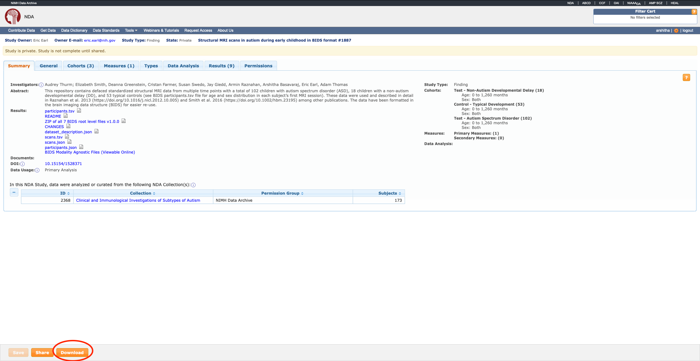
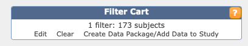
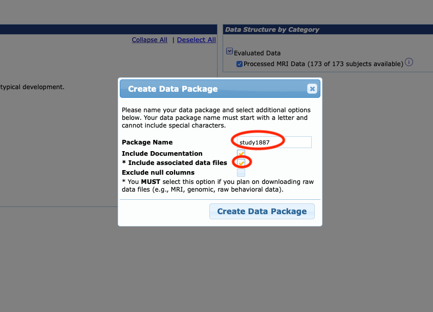
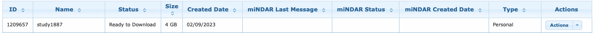

# The Clinical and Immunological Investigations of Subtypes of Autism

- [Overview](#overview)
- [Neuroimaging](#neuroimaging)
- [NDA Data Download](#nda-data-download)
  - [Creating a Data Package](#creating-a-data-package)
  - [Downloading the Data Package](#downloading-the-data-package)
- [NDA Data Package to BIDS Directory](#nda-data-package-to-bids-directory)
- [Data Preparation Notes](#data-preparation-notes)

## Overview

[Autism spectrum disorder (ASD)](https://medlineplus.gov/genetics/condition/autism-spectrum-disorder) is a common
neurodevelopmental disorder that is behaviorally defined, emerges early in life, encompasses a heterogeneous range of
presentations, and is characterized by deficits in social communication and patterns of restrictive/repetitive behavior.
The purpose of this study was to learn more about autism and its subtypes.

The study used comprehensive and longitudinal medical assessments, and behavioral testing to find
subgroups of children with autism with profiles that comprise distinct biological/behavioral phenotypes. Data collection
started on February 22, 2006, and was completed on March 15, 2017. For more information regarding the study design,
please visit [https://clinicaltrials.gov/ct2/show/NCT00298246](https://clinicaltrials.gov/ct2/show/NCT00298246).

## Neuroimaging

Given the difficulty of obtaining high-quality neuroimaging data in young children with autism, we scanned children with
autism under sedation using propofol. Sedation was performed at the NIH by board-certified anesthesiologists following a
strict clinical protocol. Typically developing controls were scanned during natural sleep at nighttime (with repeat
scans taken in the event of excess movement).

All participants were scanned on the same 1.5 T General Electric Signa scanner (Milwaukee, WI) using a
three‐dimensional (3D) spoiled gradient recalled echo sequence with the following image acquisition parameters:

| Parameter             | Value     |
|-----------------------|-----------|
| Echo time (TE)        | 5 ms      |
| Repetition time (TR)  | 24 ms     |
| Flip angle            | 45°       |
| Acquisition matrix    | 256 × 192 |
| Number of excitations | 1         |
| Field of view         | 24 cm     |

## NDA Data Download

The Anatomical imaging data have been shared on [NIMH Data Archive (NDA)](https://nda.nih.gov) as [Study 1887](https://nda.nih.gov/study.html?tab=general&id=1887). To request access please visit [https://nda.nih.gov/nda/access-data-info.html](https://nda.nih.gov/nda/access-data-info.html).

To download data from NDA, the user would have to:
1. Create a data package.
2. Use NDA's command-line tool or Download Manager to download the data package. 

### Creating a Data Package

Steps below demonstrate creating a data package from [NDA](https://nda.nih.gov)

1. Go to NDA study 1887 page and click on the `Download` button at the bottom of the page.

    


3. The cart at top right corner should now have 173 subjects. Give it a few seconds to update. Click on `Create Data Package/Add Data to Study` button to see the next prompt.

    


3. Provide a desired name for the new package. Make sure to check the `Include associated data files` to download NIfTI images along with the metadata. 

    


4. Go back to your account dashboard and click on `Data Packages`. It might take about 15-20 minutes to create the package but once it's ready you should see something like this under data packages list. 

    

### Downloading the Data Package

The NDA Study 1887 data package is 4 GB in size. Here's a condensed version of the command-line download instructions provided by NDA at https://github.com/NDAR/nda-tools#installing-python

1. Install the python client `nda-tools` with

    `python3 -m pip install nda-tools --user`

2. Save your NDA credentials to `keyring`, a python package used by NDA to authenticate users. Here's an example command:

    `keyring set nda-tools <nda-username>`

3. Run the `downloadcmd` command by specifying the data package ID that was created in the previous step

    `downloadcmd -dp <data-package-id> -d <path-to-destination-directory>`

Please find instructions to download a package through NDA Download Manager [here](https://nda.nih.gov/tools/nda-tools.html#download-manager-beta).

Here's a snapshot of the partial directory after the data package has been downloaded:
```bash
study1887
├── README.pdf
├── dataset_collection.txt
├── datastructure_manifest.txt
├── fmriresults01
│   ├── manifests
│   ├── sub-NDARXXXXXXXX
...
│   ├── sub-NDARXXXXXXXX
│   └── sub-NDARXXXXXXXX
├── fmriresults01.txt
├── md5_values.txt
├── package_info.txt
├── results
│   ├── CHANGES
│   ├── README.md
│   ├── bidsify_1887.py
│   ├── dataset_description.json
│   ├── participants.json
│   ├── participants.tsv
│   ├── scans.json
│   └── scans.tsv
└── study_1887.pdf

```

## NDA Data Package to BIDS Directory 

To be BIDS standard compliant, we provide a script `bidsify_1887.py` to convert the data downloaded through NDA into a BIDS format dataset. The script is distributed with the NDA Study 1887 data package and is available through this study repository as well.

Here's an example to `copy` over the NIfTI and associated metadata files into a new directory. 

`python3 bidsify_1887 -i nda-study-1887 -b bids-study-1887 -m copy`

The user can also choose other file mapping methods such as `softlink` and `move` options. The help prompt for script is as follows:
```
$ python bidsify_1887.py -h                                                   
usage: bidsify_1887.py [-h] -i INPUT_DIR -b BIDS_DIR -m METHOD

This script generates BIDS formatted directory for NDA Study 1887 downloaded from NDA.

optional arguments:
  -h, --help            show this help message and exit
  -i INPUT_DIR, --input INPUT_DIR
                        Path to input directory with data downloaded from NDA Study 1887 containing fmriresults01/ and results/ subfolders.
  -b BIDS_DIR, --bids BIDS_DIR, -d BIDS_DIR, --destination BIDS_DIR
                        Path to output the BIDS formatted directory.
  -m METHOD, --method METHOD
                        Choose a method by which you'd like the files mapped:
                                                    copy = Outputs copies to the destination BIDS directory.
                                                    move = Moves files (without creating a copy) to the destination BIDS directory.
                                                    softlink = Create a softlink (a.k.a. symbolic link or symlink) between NDA files and the destination BIDS directory.


```

## Data Preparation Notes
Anatomical imaging data is shared in a minimally processed, raw format. However, in order to facilitate data
analysis, the MRI data are converted to NIfTI and transformed into BIDS format using [Dcm2Bids version
2.1.6](https://github.com/UNFmontreal/Dcm2Bids/releases/tag/2.1.6), which is a wrapper for [dcm2niix version
1.0.20211006](https://github.com/rordenlab/dcm2niix). The
following [modality agnostic files](https://bids-specification.readthedocs.io/en/stable/03-modality-agnostic-files.html#modality-agnostic-files)
have been shared as supporting documentation:

| Filename                   | Description                                                                                            |
|----------------------------|--------------------------------------------------------------------------------------------------------|
| `dataset_description.json` | A JSON file describing the dataset.                                                                    |
| `README`                   | A text file describing the dataset in greater detail.                                                  |
| `CHANGES`                  | A text file with version history of the dataset (describing changes, updates and corrections).         |
| `participants.tsv`         | A tab separated tabular file with additional information like age, sex, and group of each participant. |
| `participants.json`        | A JSON formatted data dictionary describing fields in `participants.tsv`.        |
| `scans.tsv`                | A tab separated tabular file indicating the method used to deface every scan available in the dataset. |
| `scans.json`               | A JSON formatted data dictionary describing fields in `scans.tsv`.                                     |

**NOTE:** Upon downloading the imaging data from NDA, please include the above files at the root level. This is REQUIRED
if your analysis pipeline uses [BIDS Apps](https://bids-apps.neuroimaging.io/about/).

The structural image types included in the dataset are T1w, T2w, FLAIR, PDw, and MTR. For Magnetization Transfer Ratio (
MTR) images acquired in the presence and absence of an MT pulse have the `mt-on` and `mt-off` entities in their
filenames, respectively.

To preserve subject privacy, MRI scans are defaced
using [AFNI Refacer version 2.4](https://afni.nimh.nih.gov/pub/dist/doc/htmldoc/tutorials/refacer/refacer_run.html).
Defaced scans were visually inspected for quality
using [VisualQC's](https://github.com/raamana/visualqc/tree/0.6.1https://github.com/raamana/visualqc/tree/0.6.1) suite
of QC tools. 8 of the 31 scans that failed first round of QC were manually defaced
using [FSLeyes image editor](https://open.win.ox.ac.uk/pages/fsl/fsleyes/fsleyes/userdoc/editing_images.html) and the
rest were programmatically corrected to ensure defacing quality. More details on the defacing workflow used can be
found [here](https://github.com/nih-fmrif/dsst-defacing-pipeline).

## Code availability

Scripts used for DICOM to BIDS format conversion and de-identification of anatomical MRI scans
are available on the git repository at [https://github.com/nimh-dsst/nda-study-1887](https://github.com/nimh-dsst/nda-study-1887).
